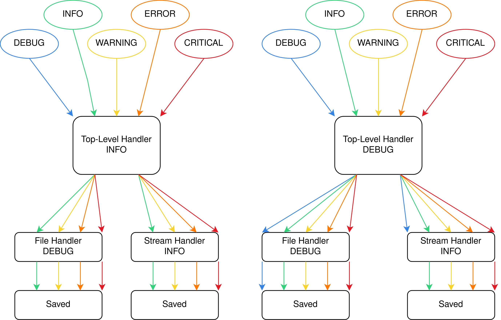

# Logging

A number of logging messages have been set up throughout `rain`'s software.
These messages can be of one of five different levels, from lowest to highest level:

- `DEBUG`
- `INFO`
- `WARNING`
- `ERROR`
- `CRITICAL`

Logging messages provide information on how the software is functioning, and are displayed or stored for the user.
There are two possible log outputs:

- File handler: logging messages are saved to a file
- Stream handler: logging messages are passed onto `stdout`, where they can be printed to the console for example

Both outputs can be used at once using `rain`, and both can be set to different levels, so that they can store only the messages that the user wants to keep.
This means the logging levels essentially act as filters.
They can also be set to the `NOTSET` level, which allows all messages to be recorded.

There is also a top-level message handler, with its own logging level.
This acts as a first filter for all messages, before they are passed to a handler.
Therefore, if a file/stream handler is set to a lower level than the top-level handler, it will miss out on lower-level messages.

More information regarding logging can be found in the logging [library documentation](https://docs.python.org/3/library/logging.html).

